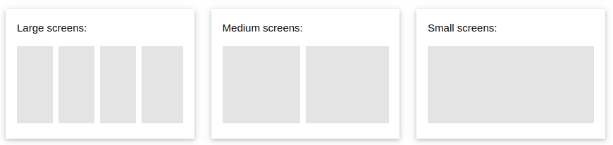
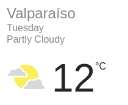
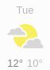
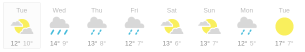

# Pauta I3

## Parte 1 (20 pts): Preguntas teóricas

Responde, de forma precisa, las siguientes preguntas: 

* (2 pts) ¿Cuál es la relación entre un nombre de dominio y los `DNS`?

**R:** Los `DNS` transforman desde direcciones de un dominio a direcciones `IP`.

* (2 pts) ¿Cuáles son las etapas al desarrollar con `TDD`?

**R:** Se escribe el test, este falla hasta que se implementa la funcionalidad y el test pasa. Luego entra a una etapa de refactor y el test comienza a fallar. El proceso se repite.

* (2 pts) ¿Cómo apoyan los *tests* al proceso de integración continua?

**R:** Los *tests* son la forma de integrar cambios continuamente con la seguridad de no romper nada.

* (2 pts) ¿Cuál es la diferencia entre *adaptive web design* y *responsive web design*?

**R:** *Adaptive web design* es un *layout* para "cada" pantalla. En el otro caso es un *layout* que se adapta dependiendo de la pantalla.

* (2 pts) Indica dos ejemplos de cosas que son posibles de hacer con *media queries* y no con *layouts* líquidos.

**R:** Los *layouts* líquidos son solo para temas de tamaño (en general), por lo que cualquier otra cosa como cambiar color de fondo, color de letra, ocultar elementos, entre otros, se puede hacer con *media queries*

* (2 pts) ¿A qué se refiere la característica de *layered system* de las `APIs REST`?

**R:** El cliente no debería saber si le pregunta al servidor final o no. Podría ser a uno intermedio o a otro que esté realizando la misma labor.

* (2 pts) ¿Cuál es la importancia de las `props` en React?

**R:** Es la forma de cambiar algún comportamiento del componente, por ejemplo, cambiar el texto de un título o no.

* (2 pts) Indica un ejemplo que muestre que las acciones "suban" en React.

**R:** Si como `prop` le entrego una función a un componente, él gatillará la función que está escrita en un componente ubicado "más arriba" que él.

* (2 pts) ¿Cuál es la función de una `API`?

**R:** Establecer una interfaz entre mi aplicación y otras.

* (2 pts) ¿Cómo el servidor sabe qué usuario es el que realiza el *request* al intercambiar un token `JWT`? (en el ejemplo implementado en clases)

**R:** Uno de los campos de un token `JWT` es la data, donde ahí se agrega el id del usuario. De esta forma cuando el token regresa al servidor, este lo "lee" y puede obtener ese id.


## Parte 2 (40 pts): Preguntas prácticas

**NOTA:** Parte A y B en hojas separadas.

### Parte A (10 pts): Diferentes tamaños

Escriba un código `HTML` (sólo el `body`) y `CSS` que muestre 4 párrafos dependiendo del ancho de la pantalla. La forma de mostrarlos debe ser como se muestra en la siguiente figura:



La imagen muestra cuántos párrafos deben mostrarse en la misma fila. En los casos que se muestran menos, quiere decir que estos se encuentran bajo los que aparecen. Pantallas grandes se consideran sobre los 992 `px` y, medianas entre ese valor y 600 `px`.

#### Una solución

```css
.column {
  float: left;
  width: 25%;
}

@media screen and (max-width: 992px) {
  .column {
    width: 50%;
  }
}

@media screen and (max-width: 600px) {
  .column {
    width: 100%;
  }
}

/* source: https://www.w3schools.com/css/css3_mediaqueries_ex.asp */
```

```html
<p class="column">Example Text 1</p>
<p class="column">Example Text 2</p>
<p class="column">Example Text 3</p>
<p class="column">Example Text 4</p>
```

**Pauta:**
* 3 pts cada caso (small, medium, large) - Total 9 pts
* 1 pt `HTML`

### Parte B (30 pts): Mostrando el clima

Encontraste una `API` que te entrega el clima. La respuesta tiene el siguiente formato (`JSON`)

```json
{
  "city": "Valparaíso",
  "current": {
    "temp": 12,
    "day": "Tuesday",
    "weather": "PARTLY_CLOUDY",
    "min": 5,
    "max": 12
  },
  "forecast": [
    {
      "day": "Mon",
      "weather": "SUNNY",
      "min": 5,
      "max": 12
    },
    { ... },
    { ... },
  ]
}
```

En el caso de `weather` puede tomar los valores de: `SUNNY`, `CLOUDY`, `RAIN`, `SHOWERS`, `SNOW` y `PARTLY_CLOUDY`}. Bajo la propiedad `forecast`, hay siete objetos (uno para cada día de la semana) con los datos que se esperan para cada día. Puedes suponer que estos objetos vienen en orden para los días de la semana. Las temperaturas están en *celsius*.

Utilizando sólo un *smart component*, escribe los componentes mínimos necesarios (reutilizando componentes si lo requieres) para mostrar el tiempo de Valparaíso. Debes ser capaz de mostrar el clima en todas estas formas:

Clima actual



Clima actual (versión mini)



Pronóstico proximos 7 días



(Imágenes obtenidas de Google)

La `URL` de la `API` es `https://valpo.clima.cl/`. Las imágenes puedes encontrarlas en `https://images.clima.cl/<WEATHER>.png`, donde `WEATHER` es uno de los valores antes mencionados. Puedes suponer que las imágenes son cuadradas.

Además, debes indicar cómo se utiliza tu componente (un pequeño código de ejemplo) para desplegar las vistas antes mencionadas. La integración del estilo ya se encuentra implementada.

En resumen, debes responder:

* Componentes para mostrar el clima correctamente
* Estilos (énfasis en posicionamiento y tamaños)
* Cómo lograr las vistas antes indicadas con los componentes creados

Por si olvidaste escribir un componente React:

```jsx
import React from 'react';
import PropTypes from 'prop-types';
import faker from 'faker';

export default function TodoList(props) {
  return (
    <ul>
      { props.items.map(item => <li key={`${faker.random.uuid()}`}>{item}</li>) }
    </ul>
  );
}

TodoList.propTypes = {
  items: PropTypes.arrayOf(PropTypes.string).isRequired,
};
```

#### Una solución

* Estilos

```css
/* MINI WEATHER */

.mini-weather {
  max-width: 200px /* Podría ser otro valor */
}

.centered-text {
  text-align: center;
}

.weather-mini-image {
  margin: 0 auto;
}

/* CURRENT WEATHER */

.current-weather {
  max-width: 350px; /* Podría ser otro valor */
}

.city-title {
  font-size: 18px; /* Podría ser otro valor */
}

.weather-current-image {
  display: inline-block;
}

.weather-text {
  display: inline-block;
  font-size: 24px; /* Podría ser otro valor */
}

/* FORECAST */

.forecast-day {
  display: inline-block;
}
```

* Componente `WeatherMini`

```jsx
import React from 'react';
import PropTypes from 'prop-types';

export default function WeatherMini({ max, min, day, weather }) {
  return (
    <div class="mini-weather">
      <p class="centered-text">{day}</p>
      
      <p class="centered-text">{max}° {min}°</p>
    </div>
  )
}

WeatherMini.propTypes = {
  max: PropType.number.isRequired,
  min: PropType.number.isRequired,
  day: PropType.string.isRequired,
  weather: PropType.string.isRequired,
}
```

* Componente `CurrentWeather`

```jsx
import React from 'react';
import PropTypes from 'prop-types';

const WEATHER = {
  SUNNY: 'Sunny',
  CLOUDY: 'Cloudy',
  RAIN: 'Rain',
  SHOWERS: 'Showers',
  SNOW: 'Snow',
  PARTLY_CLOUDY: 'Partly Cloudy',
};

export default function CurrentWeather({ city, temp, day, weather }) {
  return (
    <div class="current-weather">
      <p class="city-title">{city}</p>
      <p>{day}</p>
      <p>{WEATHER[weather]}</p>
      <div>
        
        <p class="weather-text">{temp} °C</p>
      </div>
    </div>
  )
}

CurrentWeather.propTypes = {
  city: PropType.string.isRequired,
  temp: PropType.number.isRequired,
  day: PropType.string.isRequired,
  weather: PropType.string.isRequired,
}
```

* Componente `Forecast`

```jsx
import React from 'react';
import PropTypes from 'prop-types';
import WeatherMini from './WeatherMini';

export default function Forecast({ forecast }) {
  return forecast.map(day => (
    <div class="forecast-day">
      <WeatherMini min={day.min} max={day.max} day={day.day} wheater={day.weather} />
    </div>
  ));
};

WeatherMini.propTypes = {
  forecast: PropTypes.arrayOf(PropTypes.shape({})).isRequired,
};
```

* Componente `CityWeather`

```jsx
import React, { Component } from 'react';
import PropTypes from 'prop-types';
import WeatherMini from './WeatherMini';
import CurrentWeather from './CurrentWeather';
import Forecast from './Forecast';

export default class CityWeather extends Component {
  constructor(props) {
    super(props);

    this.state = {
      loading: true,
      weatherData: undefined,
    };
  }

  async componentDidMount() {
    const weatherData = await fetch('https://valpo.clima.cl/').then(response => response.json());
    this.setState({ loading: false, weatherData });
  }

  render() {
    if (this.state.loading) return <p>Loading...</p>;
    if (this.props.display === "forecast") {
      return <Forecast forecast={this.state.weatherData.forecast} />;
    } else if (this.props.display === "mini") {
      const { temp, min, day, weather } = this.state.weatherData.current;
      return <WeatherMini max={temp} min={min} day={day} weather={weather} />;
    }
    
    const { city, temp, day, weather } = this.state.weatherData.current;
      return <CurrentWeather city={city} temp={temp} day={day} weather={weather} />;
  }
}

CityWeather.propTypes = {
  display: PropTypes.string.isRequired,
};
```

* Ejemplos de uso

```jsx
// Para la versión forecast
<CityWeather display="forecast" />

// Para la versión mini
<CityWeather display="mini" />

// Para la versión current
<CityWeather />
```

**Pauta:**

* 5 pts por cada *dumb component* - Total 15 pts
  * 3 pts por render correcto
  * 1 pt por proptypes
  * 1 pt uso de props
* 10 pts por *smart component*
  * 6 pts por render en cada caso (loading, y los 3 *dumb components*)
  * 2 pts por obtener correctamente la data
  * 2 pts por uso de estado y correcta declaración de la clase
* 3 pts por ejemplo de uso
* 2 pts por `CSS`